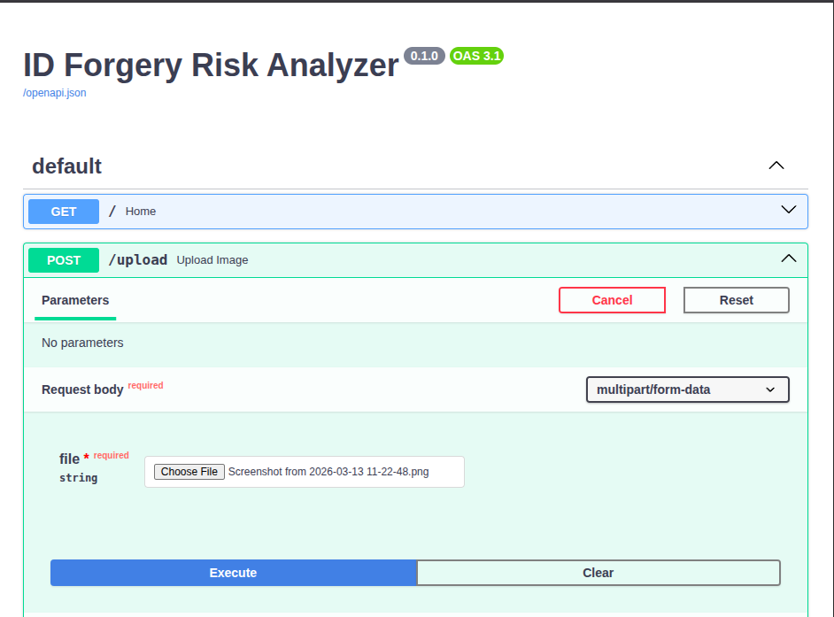
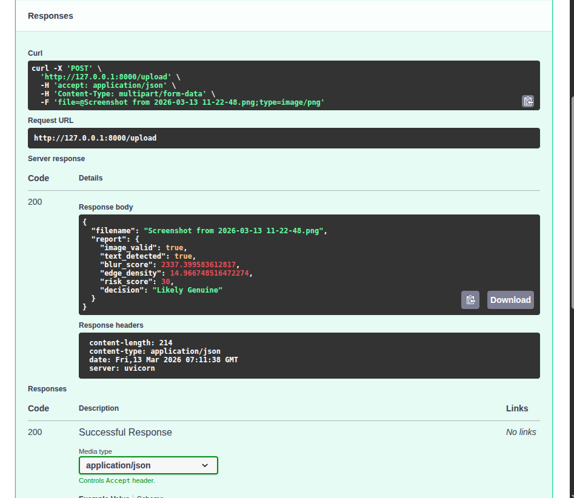
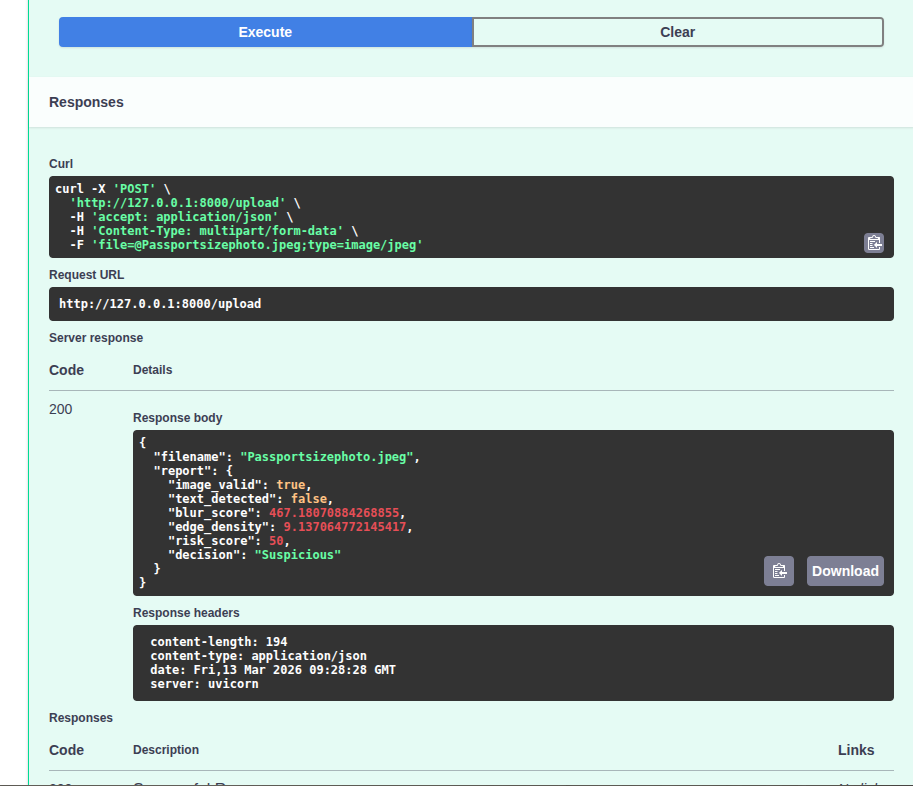

# ID Document Forgery Risk Analyzer

This project is a prototype system that analyzes uploaded ID document images and produces a fraud risk report indicating whether the document may be genuine or suspicious.

## Project Goal

The goal is not perfect accuracy but to demonstrate:
- Problem understanding
- Fraud detection approach
- Combining AI tools
- Reasoning and reporting

## Features

- Upload ID document image
- Validate image file type
- Extract text using OCR
- Detect blur and image quality issues
- Detect edge anomalies indicating possible tampering
- Generate structured fraud detection report

## Technologies Used

- Python
- FastAPI
- OpenCV
- Tesseract OCR

## How It Works

1. User uploads an ID document image
2. The system validates the file type
3. OCR extracts text from the image
4. Image analysis checks blur and edges
5. A fraud risk score is calculated
6. A structured report is returned

## Example Fraud Report

```json
{
 "image_valid": true,
 "text_detected": true,
 "blur_score": 176.3,
 "edge_density": 0.03,
 "risk_score": 10,
 "decision": "Likely Genuine"
}

## Example Output Screenshots

### Valid Image Example


### OCR Text Detection Example


### Fraud Detection API Response


